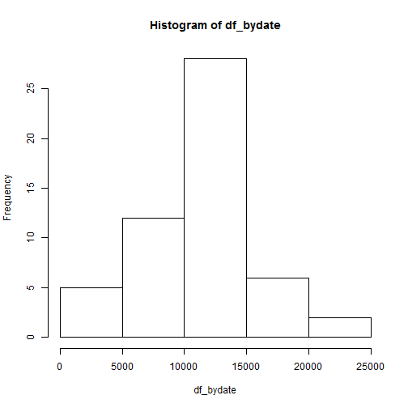
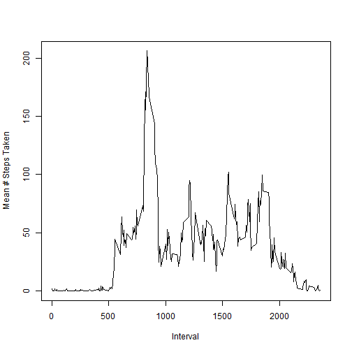
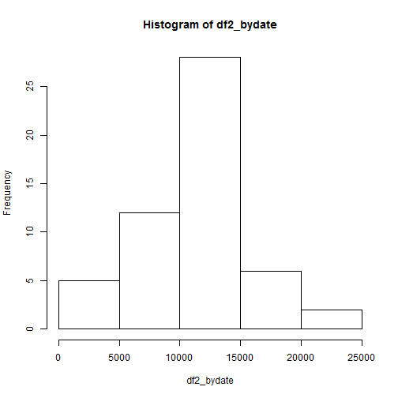

# Reproducible Research: Peer Assessment 1


## Loading and preprocessing the data

The following R code will read all CSV data from the activity.zip file contained within the working directory, and process the data into a format suitable for analysis:


```r
# Load the data 
df <- read.csv(unz("activity.zip", "activity.csv"), header=T)

# Process/transform the data into a format suitable for analysis

df[, 'steps'] <- as.numeric(df$steps)
df[, 'date'] <- as.Date(substr(df$date, 1, 10))
df[, 'interval'] <- as.numeric(df$interval)

# create a dataframe by date
df_bydate <- tapply(df$steps, df$date, sum)
```

## What is mean total number of steps taken per day?

Below is a histogram of the total number of steps taken each day:

```r
# Make a histogram of the total number of steps taken each day
hist(df_bydate)
```

 


```r
# Calculate and report the mean and median total number of steps taken per day
library(xtable)
summary(df_bydate)
```

```
##    Min. 1st Qu.  Median    Mean 3rd Qu.    Max.    NA's 
##      41    8840   10800   10800   13300   21200       8
```

```r
dfmean <- mean(df_bydate, na.rm=T)
dfmedian <- median(df_bydate, na.rm=T)
```
The mean for this dataset is 1.0766 &times; 10<sup>4</sup> and the median is 1.0765 &times; 10<sup>4</sup>.


## What is the average daily activity pattern?

Below is a time-series ploy of the 5-minute intervals and average number of steps taken, averaged across all days:

```r
# Make a time series plot (i.e. type = "l") of the 5-minute interval (x-axis) and the average number of steps taken, averaged across all days (y-axis)
df_byinterval <- aggregate(df$steps, by=list(df$interval), FUN="mean", na.rm=T)
names(df_byinterval) <- c("interval", "steps")
plot(df_byinterval$interval, df_byinterval$steps, type="l", xlab="Interval", ylab="Mean # Steps Taken")
```

 

Below is the 5-minute interval that contains the maximum number of steps in this dataset:


```r
# Which 5-minute interval, on average across all the days in the dataset, contains the maximum number of steps?
df_byinterval[df_byinterval$steps==max(df_byinterval$steps),]
```

```
##     interval steps
## 104      835 206.2
```

## Imputing missing values


```r
# Calculate and report the total number of missing values in the dataset (i.e. the total number of rows with NAs)
missing_values <- sum(is.na(df))
```
There are 2304 missing from the dataset.

The below calculations produce a strategy for filling in all of the missing values in the dataset using the mean for the day in which the missing value is found.  It's based on the excellent code snippet by Hadley Wickham and [publically accessible here](http://www.mail-archive.com/r-help@r-project.org/msg58289.html).


```r
# Devise a strategy for filling in all of the missing values in the dataset. The strategy does not need to be sophisticated. For example, you could use the mean/median for that day, or the mean for that 5-minute interval, etc.
# Create a new dataset that is equal to the original dataset but with the missing data filled in.
library(plyr)
impute.mean <- function(x) replace(x, is.na(x), mean(x, na.rm = TRUE))
df2 <- ddply(df, ~ date, transform, steps = impute.mean(steps))
```


```r
# Make a histogram of the total number of steps taken each day and Calculate and report the mean and median total number of steps taken per day. Do these values differ from the estimates from the first part of the assignment? What is the impact of imputing missing data on the estimates of the total daily number of steps?
df2_bydate <- tapply(df2$steps, df2$date, sum)
hist(df2_bydate)
```

 

```r
df2_mean <- mean(df2_bydate, na.rm=T)
df2_median <- median(df2_bydate, na.rm=T)
```
The mean for this revised dataset is 1.0766 &times; 10<sup>4</sup> and the median is 1.0765 &times; 10<sup>4</sup>.


## Are there differences in activity patterns between weekdays and weekends?


```r
# For this part the weekdays() function may be of some help here. Use the dataset with the filled-in missing values for this part.

# Create a new factor variable in the dataset with two levels – “weekday” and “weekend” indicating whether a given date is a weekday or weekend day.

# Make a panel plot containing a time series plot (i.e. type = "l") of the 5-minute interval (x-axis) and the average number of steps taken, averaged across all weekday days or weekend days (y-axis). 
```
